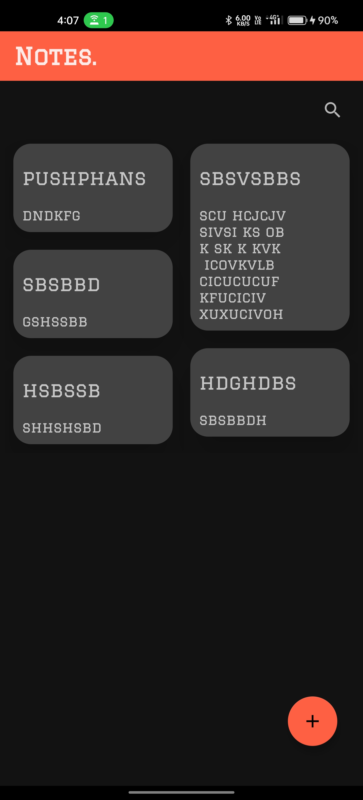
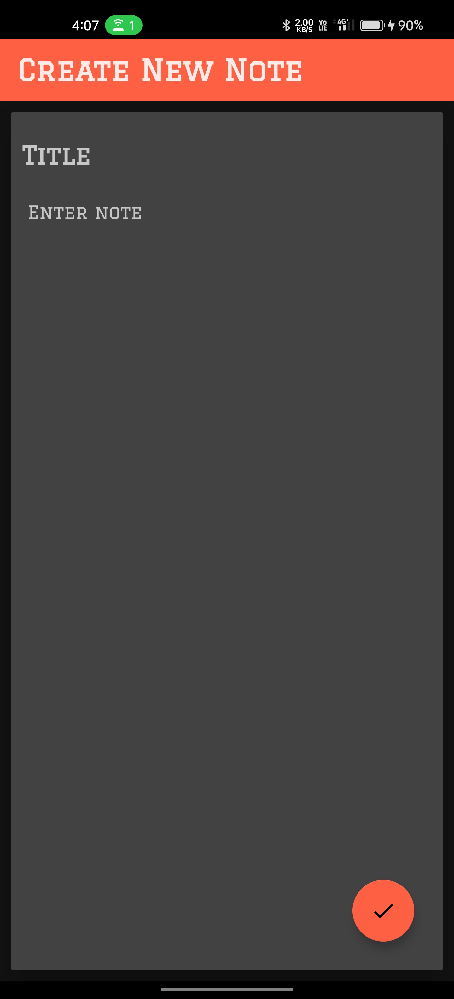
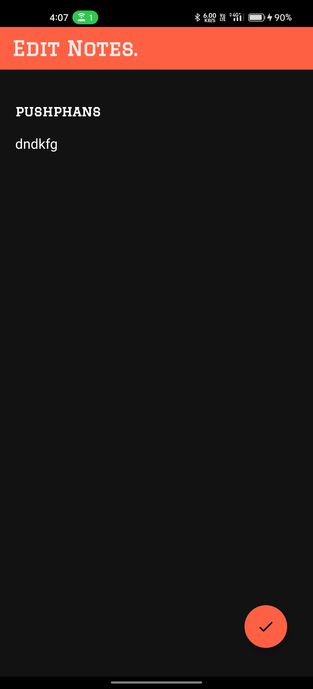
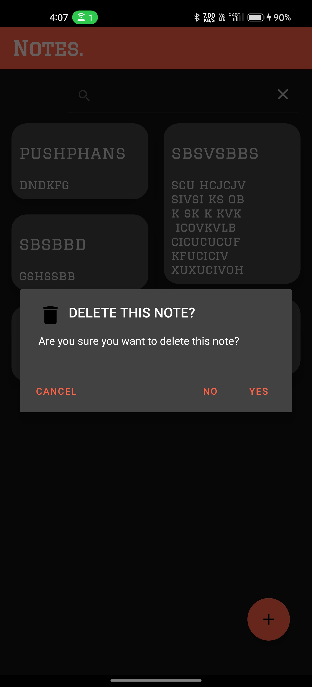
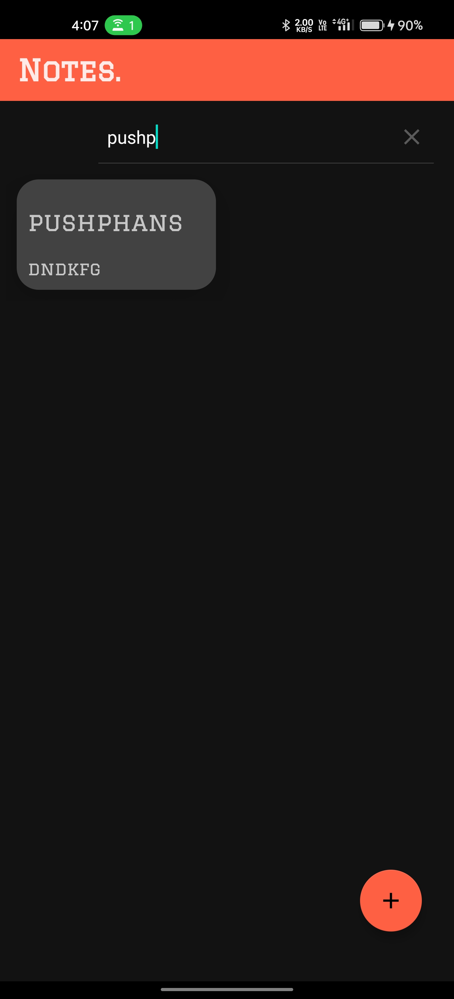

# 📝 Notes App
>A simple and minimal note-taking Android app using Room database — perfect for jotting down thoughts, to-dos, and ideas, all with offline support.

<br>

## 🖼️ Screenshots
<!-- Replace underscores with your actual image filenames -->
### 🔸 Home Screen (Staggered Notes View)


<br>

### 🔸 Add Note


<br>

### 🔸 Edit Note


<br>

### 🔸 Delete Dialog


<br>

### 🔸 Search Notes
 

<br>

## 🚀 Features
- 📋 View notes in a clean staggered layout
- ➕ Add new notes using Floating Action Button (FAB)
- 🔍 Search notes instantly with SearchView
- ✏️ Edit existing notes on tap
- 🗑️ Delete notes via long press with confirmation dialog
- 💾 Offline-first with Room DB for persistent storage

<br>

## 🔧 Tech Stack
- Language: Kotlin
- Architecture: MVVM
- Backend: Room Database
- Libraries: ViewBinding, RecyclerView, Material Design

<br>

## 🛠️ Installation
1. Clone the repository
    ```bash
   git clone https://github.com/pushphans/NotesApp.git

2. Open the project in Android Studio
3. Build and run the app on an emulator or physical device

<br>

## 📬 Contact
>For any queries or suggestions, reach out at: 📧 pushp.hans1502@gmail.com

